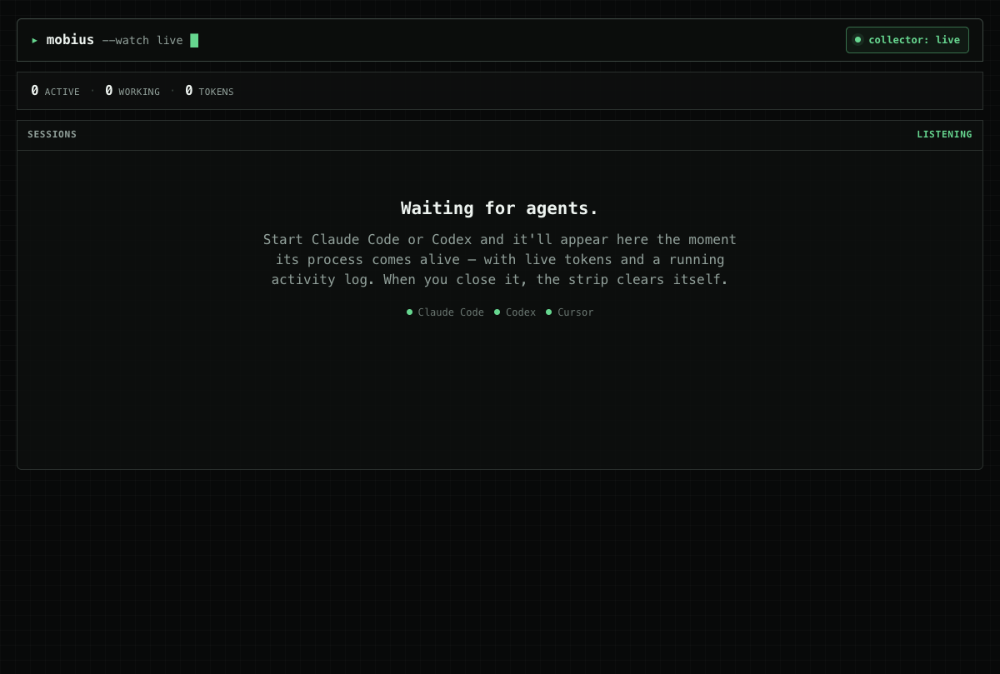

# Mobius

Mobius is a macOS desktop app for watching local AI coding agents in one live
view. It tracks active sessions, live process state, token usage, current work,
and recent file activity so you can see what each agent is doing without
jumping between terminals.



## Status

Mobius currently observes Claude Code, Codex, and Hermes sessions. Cursor support
is planned but not wired into the collector yet.

## Development

```sh
npm install
npm run tauri dev
```

The Rust collector lives in `src-tauri/`. The webview UI lives in `src/`.

Useful checks:

```sh
npm test
npm run build
cd src-tauri && cargo test --lib
```
